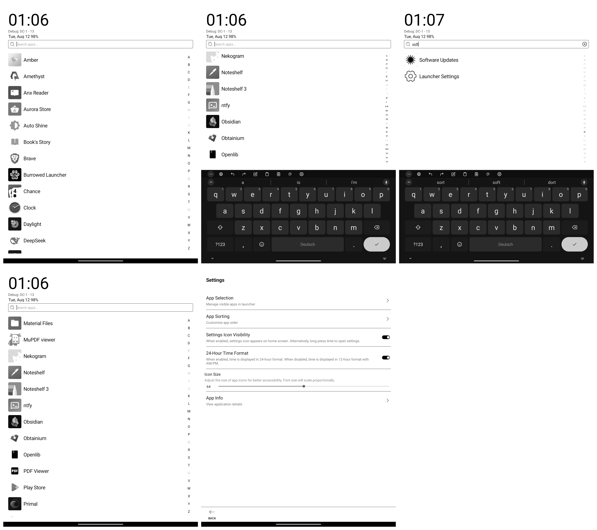

# Burrow UI

Burrow UI is an open-source, free launcher designed specifically for E-ink devices. Inspired by the Niagara Launcher, Burrow UI offers a minimalist and efficient interface tailored for E-ink screens.

## Features

- **Open Source and Free**: Burrow UI is completely open-source and free to use, with no hidden costs or in-app purchases.
- **No Ads**: Enjoy a clean, distraction-free experience without any advertisements.
- **Offline Functionality**: Works entirely offline, respecting your privacy and conserving battery life.
- **Ultra-Lightweight**: With an installation package of only 130KB, Burrow UI is incredibly light on system resources.
- **E-ink Optimized**: Designed from the ground up for E-ink displays, ensuring optimal readability and performance.

## Installation

Download the latest release of Burrow UI from the [Releases](https://github.com/hamsterbase/Burrow-UI/releases)

## Support Us

If you find Burrow UI helpful, consider supporting our work:

[Buy us a coffee](https://buymeacoffee.com/hamsterbase)

## Our Other Products

Check out our other innovative products:

- [HamsterBase](https://hamsterbase.com) - A privacy-focused and offline-friendly tool for deferred reading.

## License

Distributed under the GNU General Public License v3.0 (GPL-3.0) License. See `LICENSE` for more information.

## Contact

HamsterBase - admin@hamsterbase.com

Project Link: [https://github.com/hamsterbase/burrow-ui](https://github.com/hamsterbase/burrow-ui)

## Acknowledgements

- Inspired by Niagara Launcher
